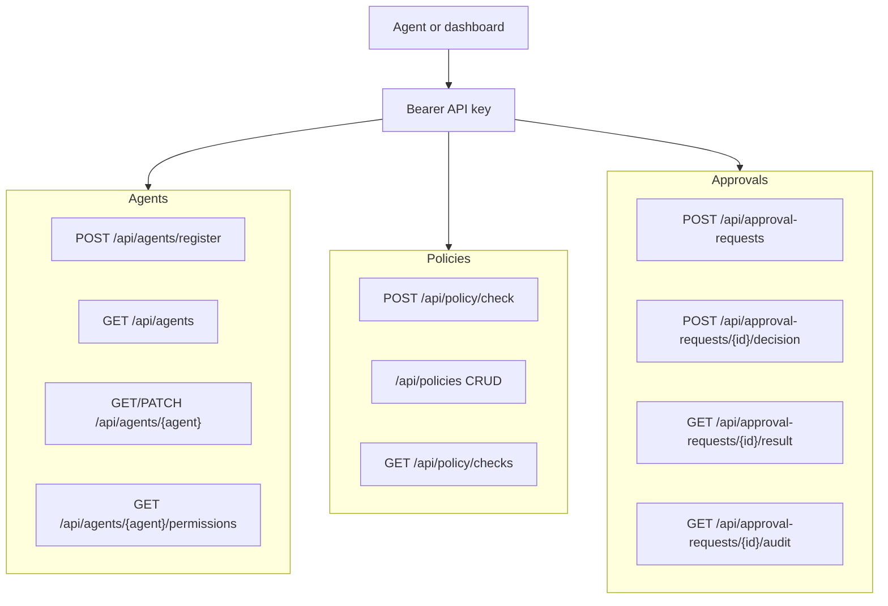

# API Surface

All protected endpoints require:

```http
Authorization: Bearer <PAT_API_KEY>
```

## Health

- `GET /api/health`

## Agents

- `POST /api/agents/register`
- `GET /api/agents`
- `GET /api/agents/{agent}`
- `PATCH /api/agents/{agent}`
- `GET /api/agents/{agent}/permissions`
- `GET /api/agents/{agent}/policy-checks`

## Policies

- `POST /api/policy/check`
- `GET /api/policy/checks`
- `GET /api/policies`
- `POST /api/policies`
- `GET /api/policies/{policy_id}`
- `PATCH /api/policies/{policy_id}`
- `DELETE /api/policies/{policy_id}`

## Approval requests

- `POST /api/approval-requests`
- `GET /api/approval-requests`
- `GET /api/approval-requests/{request_id}`
- `GET /api/approval-requests/{request_id}/result`
- `POST /api/approval-requests/{request_id}/decision`
- `GET /api/approval-requests/{request_id}/audit`

## Email intake

- `POST /api/email-intake`

Email intake is an adapter into normal approval requests. Future Gmail polling should parse Gmail
messages and submit through this same path.

## Dashboard

- `GET /`
- `/static/*`

The dashboard is currently a minimal review queue, not yet a full policy/agent management interface.


