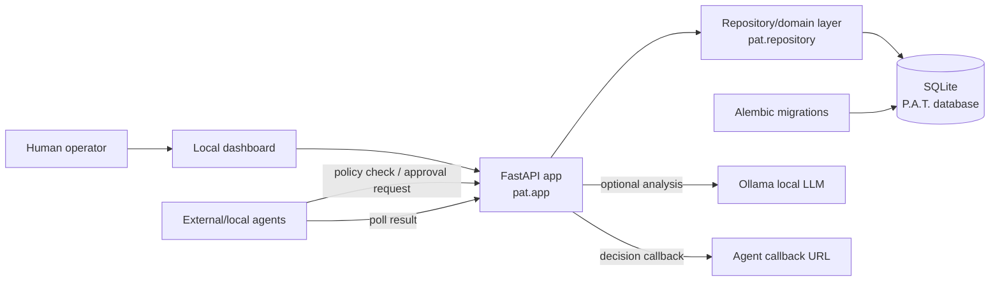
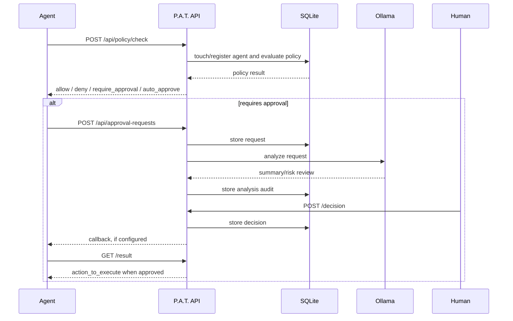
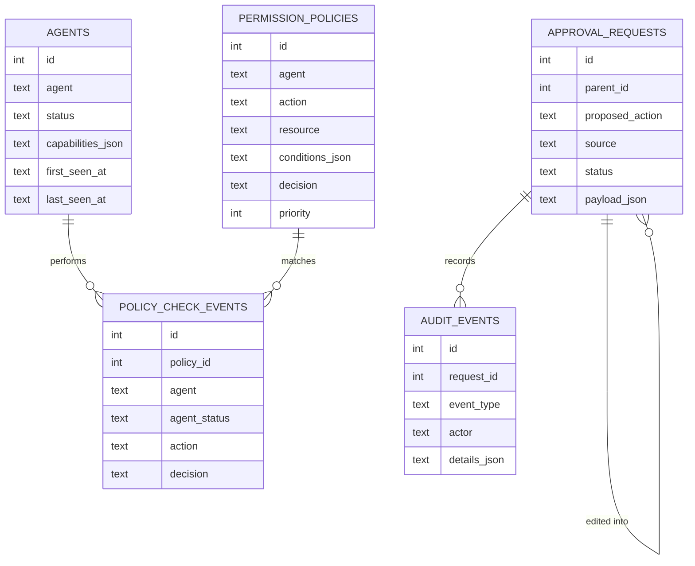

# Architecture

P.A.T. is a local web application with a backend API, a SQLite database, and a static dashboard.

## Components

- `pat.app`: FastAPI application and HTTP route definitions.
- `pat.repository`: database access and domain behavior.
- `pat.models`: Pydantic request/response models and enums.
- `pat.database`: SQLite connection management and Alembic migration entry point.
- `pat.ollama`: local Ollama analysis integration.
- `pat.callbacks`: callback payload construction and one-shot callback delivery.
- `src/pat/static`: browser dashboard assets.
- `migrations`: Alembic migration environment and versioned schema changes.
- `examples`: simple agent-side examples.

## Data flow

1. Agent registers or calls `POST /api/policy/check`.
2. P.A.T. auto-registers unknown agents as `new`.
3. P.A.T. applies agent status gating.
4. Active agents are evaluated against enabled policies.
5. If approval is required, the agent submits an approval request.
6. P.A.T. stores the proposal and asks Ollama for optional review analysis.
7. The human approves, rejects, edits, marks wrong, expires, cancels, or auto-approves through policy.
8. The submitting agent polls `/result` or receives a callback.
9. The agent executes only the approved `action_to_execute`.

## Trust boundary

P.A.T. currently uses a shared bearer token. Any process with that token can call the API, so the
agent registry is an accountability and policy layer, not strong identity. A future version should add
per-agent credentials or signed local identities.

## Persistence

SQLite is the source of truth. Alembic manages schema migrations.

Transactional records are stored relationally. A vector database is intentionally not part of v1
because approval queues, policies, and audit logs need exact filtering and deterministic behavior.

## Execution boundary

P.A.T. does not execute domain actions. It returns decisions and approved payloads. Agents are
responsible for execution and for honoring P.A.T.'s response.

## Database shape

