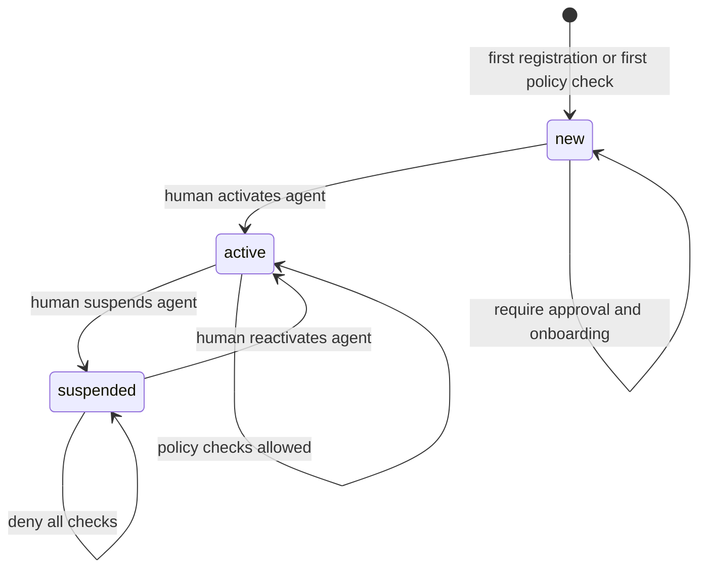
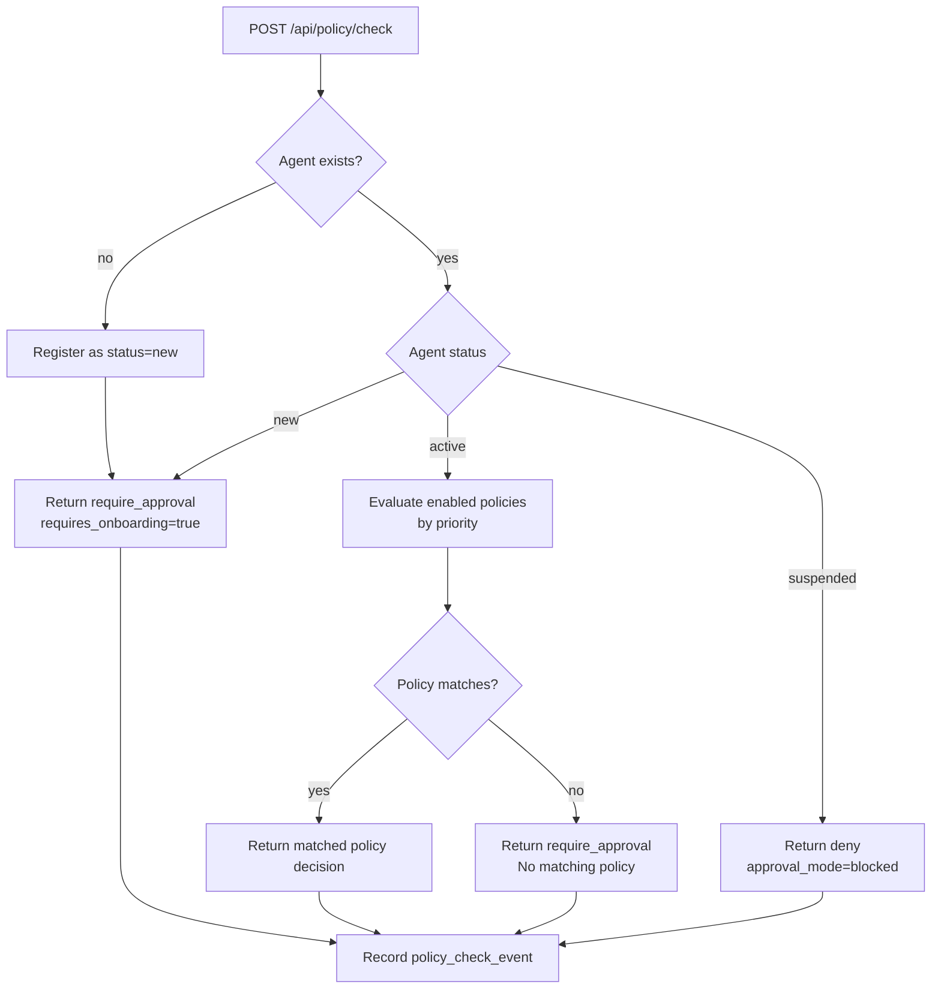
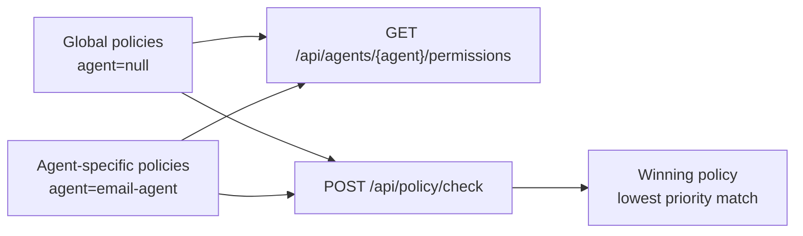

# Permission Model

P.A.T. is the local authority for whether an agent action is allowed, denied, logged, auto-approved,
or routed for manual approval.

## Agents

Agents have a registry record with:

- `agent`
- `display_name`
- `description`
- `status`
- `callback_url`
- `capabilities`
- `metadata`
- first/last seen timestamps

Statuses:

- `new`: default for first contact; always requires approval and onboarding.
- `active`: policy matching is allowed.
- `suspended`: all policy checks are denied before matching policies.

Unknown agents are automatically registered as `new` when they call `/api/policy/check`.

## Policies

Policies can be global or agent-specific.

- Global policy: `agent` is `null`.
- Agent-specific policy: `agent` is set to an agent name.

Policy fields:

- `name`
- `description`
- `enabled`
- `agent`
- `action`
- `resource`
- `conditions`
- `decision`
- `risk_level`
- `priority`

Decisions:

- `allow`
- `require_approval`
- `deny`
- `auto_approve`
- `log_only`

## Matching

Only enabled policies are considered.

P.A.T. checks policies by ascending `priority`, then id. A policy matches when:

- `agent` is null or equals the checking agent.
- `action` is null or equals the requested action.
- `resource` is null or equals the requested resource.
- every key/value in `conditions` equals the submitted `context`.

If no enabled policy matches for an active agent, P.A.T. defaults to `require_approval`.

## Effective permissions

`GET /api/agents/{agent}/permissions` returns:

- the agent record
- enabled global policies that apply to the agent
- enabled agent-specific policies
- recent policy checks for that agent

Each policy includes:

- `scope`: `global` or `agent`
- `specificity`: count of constrained fields and condition keys

Priority still determines which policy wins during actual checks.

