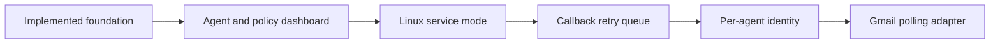

# Status

Last updated: 2026-06-29

## Implemented

- Local FastAPI app.
- Static review dashboard.
- SQLite persistence.
- Alembic migrations.
- API-key authentication.
- Approval request creation, listing, detail, decision, audit, and result endpoints.
- Edit-as-new-request behavior.
- Ollama approval analysis.
- Email intake endpoint.
- One-shot callback delivery with callback audit events.
- Permission policy CRUD.
- Policy checks with audit history.
- Agent registry and onboarding status.
- Agent-specific effective permissions endpoint.
- Polling agent example.

## Current database revisions

- `20260629_0001`: initial approval, audit, callback, policy schema.
- `20260629_0002`: agents registry and policy-check agent status.

## Known limitations

- Shared bearer token is not strong per-agent identity.
- Dashboard does not yet manage agents or policies.
- Callback delivery is one-shot; no retry queue.
- Systemd service file is not yet included.
- No desktop notifications yet.
- No Gmail polling adapter yet.
- No policy condition schema validation beyond exact JSON key/value matching.
- Startup can produce repeated Alembic log lines because `Database.init()` is called by dependencies.

## Recommended next work

1. Add dashboard views for agents and policies.
2. Add systemd user service support.
3. Add callback retry queue.
4. Add stronger agent identity/API key model.
5. Add Gmail polling adapter.

